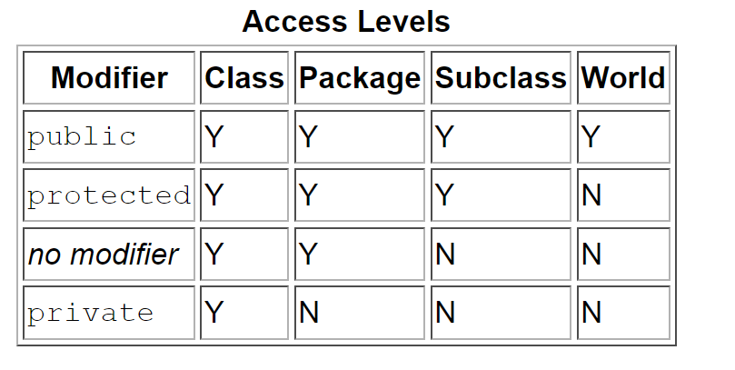

# Learning notes

* using sdkman to manage jdk
* use https://start.spring.io/ to setup spring project
* JPA vs JDBC
  * JPA ~ essentially an orm
  * JDBC ~ write sql
* apparently there is a difference between java bean and spring bean
  * java bean == simply code convention: [wikipedia](https://en.wikipedia.org/wiki/JavaBeans)
    * [java bean spec](http://java.sun.com/javase/technologies/desktop/javabeans/docs/spec.html)
  * spring bean == object managed by spring
    * [stackoverflow](https://stackoverflow.com/questions/21866571/difference-between-javabean-and-spring-bean)
    * [blog](https://www.shaunabram.com/beans-vs-pojos/)
* **@autowired**
  * simply a way for spring to inject a bean without having to "new" it manually and pass it along in the constructor
  ```java
  // Spring ###################################
  @Autowired
    public MyService(MyRepository repo) {
        this.repo = repo;
    }
  //--------------------------------------
  @SpringBootApplication
  public class App {
      public static void main(String[] args) {
          ApplicationContext ctx = SpringApplication.run(App.class, args);
          MyService service = ctx.getBean(MyService.class);
          service.doSomething();
      }
  }

  // NOT Spring ################################
    public MyService(MyRepository repo) {
        this.repo = repo;
    }
  // -------------------------------------
  public class App {
      public static void main(String[] args) {
          MyRepository repo = new MyRepository();
          MyService service = new MyService(repo);
          service.doSomething();
      }
  }
  ```
* no access modifier is 'package' level access: [docs](https://docs.oracle.com/javase/tutorial/java/javaOO/accesscontrol.html)

* should look up streams vs iterators
  * have a look at: [stackoverflow](https://stackoverflow.com/questions/31210791/iterator-versus-stream-of-java-8)
* run using `./gradlew bootRun`